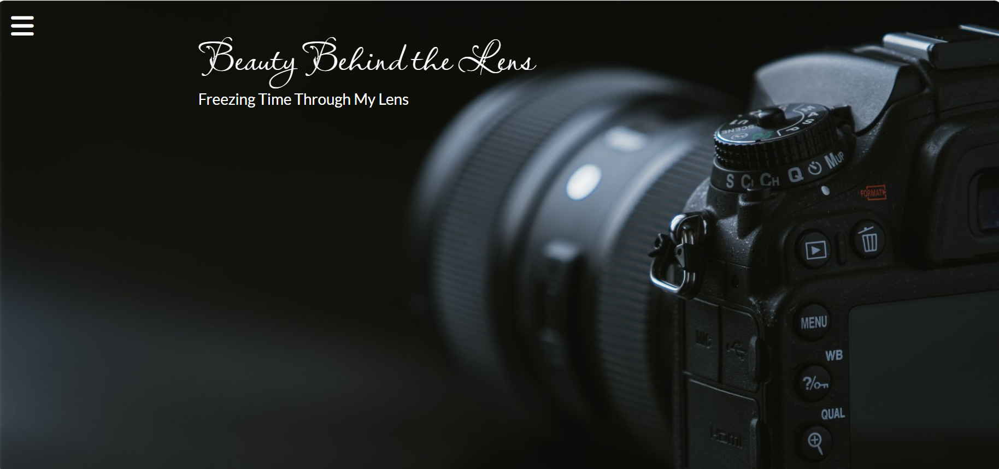

# Photography-sidebar
A clean photography-themed webpage with a sliding sidebar menu, built using HTML and CSS.

# Beauty Behind the Lens 📷
This is a simple web design project made using HTML and CSS. It has a full-screen background, a sidebar menu that opens and closes, and a heading in the center.

## 🔍 What it Includes
- A background image that covers the whole screen
- A heading with a title and a short quote
- A button to open a sidebar menu
- A sidebar with social media icons
- Smooth hover and click effects

🛠 Tools Used
HTML
CSS
Google Fonts (Roboto, Lato, Lavishly Yours)
Font Awesome (for icons)

👩‍🎨 About
This project was made for practice and learning how to create beautiful and interactive web pages with HTML and CSS. Made with the help of Apna College’s Web Dev Course.

📸 Screenshot

📬 Contact
If you'd like to share feedback, feel free to message me!
💼 LinkedIn: https://www.linkedin.com/in/kanan-preet-kaur-a46707332/
